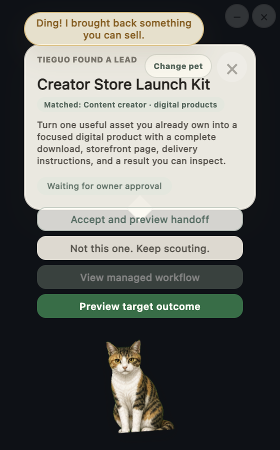
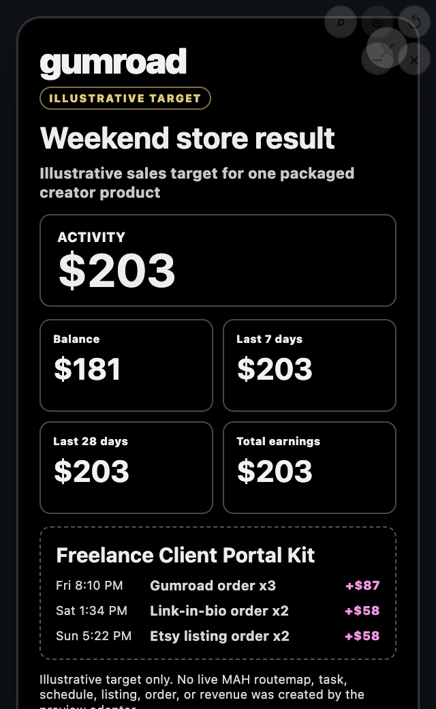
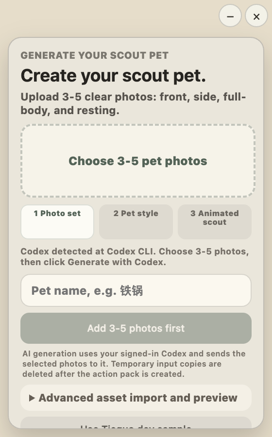
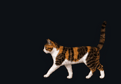
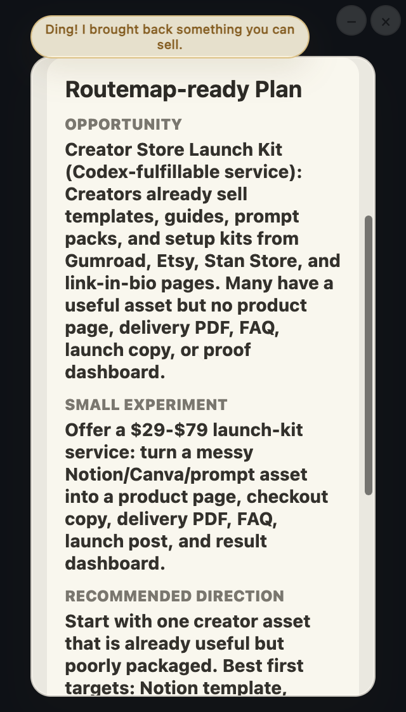

# Opportunity Pet

> **My pet learned to earn its own treats by bringing back sellable opportunities. Now it is working on paying my rent.**

<p align="center">
  
</p>

<p align="center"><em>Iron found something small enough to build and concrete enough to sell.</em></p>

<p align="center">
  
</p>

<p align="center"><em>The finish line is not another idea document. It is a product, delivered orders, and a result you can inspect.</em></p>

Opportunity Pet is a free, open-source desktop pet for builders. Give it 3-5 photos of your own animal and it becomes a small animated scout: it wanders across your desktop, brings back opportunities that match your interests, and asks whether you want to reject one, test it, or turn it into real work.

The pet is playful. The workflow behind it is serious:

```text
your pet photos
      -> animated desktop scout
      -> a small sellable opportunity
      -> owner approval
      -> managed MAH workflow
      -> a shipped product and measurable result
```

## 1. Create Your Pet

<p align="center">
  
</p>

Start with 3-5 clear photos from different angles. Opportunity Pet uses your signed-in Codex CLI to identify the animal's stable features, build a consistent multi-view character, and prepare the actions needed by each stage of the workflow.

The generated action pack is not one photo sliding around the screen. It contains distinct states:

- **Idle:** faces you, blinks, breathes, and occasionally yawns.
- **Scout:** walks left and right in side view with its tail raised.
- **Rest:** curls into a ball and stays still long enough to feel asleep.
- **Found:** turns toward you when it brings back an opportunity.
- **Send:** chases a butterfly while the approved opportunity is handed directly to MAH.
- **Happy:** reacts briefly when clicked or when a task moves forward.

The setup window disappears after generation, leaving only the small transparent desktop pet. Iron is just the included sample pet; you can replace him with your own animal.

<p align="center">
  
</p>

## 2. Let It Bring Back Leads That Fit You

Opportunity Pet is not limited to one kind of business idea. It can bring back different leads based on your preferences, skills, audience, region, risk tolerance, and the platforms you already understand.

<p align="center">
  
</p>

<p align="center"><em>The scout loop lives on your desktop: pace, notice, return, and ask for your call.</em></p>

One possible lead looks like this:

> **Creator Store Launch Kit**
>
> Turn one messy creator asset into a product page, cleaned delivery file, FAQ, launch copy, and lightweight sales report for Gumroad, Etsy, Stan Store, Shopify, or a link-in-bio store.

This kind of lead fits builders because the fulfillment work is mostly files, structured content, and small automations that Codex can produce. A customer might already have a useful Notion template, prompt pack, checklist, guide, or workflow, but still need help turning it into something another person can understand, buy, and receive.

```text
messy creator asset
      -> positioning and product page
      -> cleaned PDF / template / download
      -> FAQ and delivery instructions
      -> launch posts
      -> sales and delivery report
```

The pet does not claim that every lead will make money. Its job is to make plausible opportunities visible at the moment when you can still make a small decision: approve one, reject it, or investigate it properly.

## 3. Accept The Lead Into A Managed Workflow

Approving a card is a system handoff, not a clipboard handoff. Opportunity Pet creates a native MAH project and routemap, then renders the tasks, schedules, checkpoints, and events returned by that project.

<p align="center">
  
</p>

The handoff keeps the useful context instead of forcing another interview loop. It includes:

- Who already pays for this outcome.
- What the smallest deliverable should be.
- Which claims need evidence or human approval.
- What MAH can delegate to an agent, and where a person must decide.
- What should count as a useful first result.

For a creator-store lead, a practical first experiment is one asset, one storefront, one price, and one launch channel. MAH owns task delegation and long-running execution; you choose the niche, validate demand, and approve claims or external publishing when required.

## 4. Let MAH Run The Work

Opportunity Pet is MAH's playful business interface. It discovers and presents the lead, captures the owner's decision, and turns MAH's execution state into a visible pet reaction.

MAH is the running base underneath it: routemap evolution, task delegation, agent routing, retries, scheduled storefront checks, and long-running state. The pet does not reimplement those mechanisms.

```text
lead card -> owner accepts -> MAH project + routemap -> tasks and schedules -> progress returned to the pet
```

This repository includes a strict adapter boundary instead of inventing unpublished CLI commands. Without a production adapter, the app runs a clearly labelled local handoff preview. See [the MAH integration contract](docs/mah-integration-contract.md). The preview does not create live tasks, products, listings, orders, or revenue.

## 5. End With A Result, Not A Bookmark

Here is one concrete outcome the loop can aim for:

```text
Product: Freelance Client Portal Kit
Orders: 7
Gross revenue: $203
Files delivered: 7/7
Refunds: 0
Balance after fees: $181
```

The result page makes the finish line legible: did the product ship, did anyone buy it, were the files delivered, where did buyers come from, and did anyone ask for a refund?

Opportunity Pet does not guarantee those numbers. The point is to replace a vague promise like “AI helps you make money” with a modest, testable outcome that the workflow can actually aim at.

## Choose Your Path

Gumroad is one lightweight creator-commerce path for selling digital products, memberships, courses, and services without building a complete store from scratch. It can host a product page, take payment, deliver files or links, send receipts, manage customers and refunds, and show sales analytics.

That makes it a useful sample finish line for a digital-product lead. Codex can help package many of the deliverables, while Gumroad provides the external surface where you can see whether the offer was purchased and delivered.

- [Gumroad features](https://gumroad.com/features)
- [Gumroad analytics dashboard](https://gumroad.com/help/article/74-the-analytics-dashboard.html)
- [Gumroad customer and sales dashboard](https://gumroad.com/help/article/268-customer-dashboard)

Gumroad is only one possible destination. The same loop can point to Etsy, Shopify, Stan Store, a creator's own checkout, a paid service marketplace, a local-service booking flow, or any other path with a real transaction and delivery trail.

## What Works Today

- Import 3-5 pet photos and a name.
- Generate a multi-view identity and six aligned action states through the signed-in Codex CLI.
- Fall back to a local transparent scout if image generation is unavailable.
- Run as a small transparent Electron desktop pet on top of ordinary work.
- Scout curated opportunity cards and let the user approve or reject them.
- Hand approved leads directly into explicit MAH project, routemap, task, schedule, checkpoint, and event boundaries without clipboard copying.
- Persist and render workflow phases returned by that adapter.
- Recover an existing workflow after the desktop app restarts and prevent duplicate submissions.
- Run a clearly labelled local workflow preview until the production MAH adapter is installed.
- Open a result page that explicitly labels the intended business outcome as illustrative.
- Build packaged desktop downloads for macOS, Windows, and Linux.

The current opportunity feed is curated rather than live web search. That is intentional for this version: the complete decision and handoff loop matters more than showing a large pile of weak leads. Pluggable live sources are a later step.

## Download

Open [Opportunity Pet Releases](../../releases) and choose the build for your system:

- macOS: Apple Silicon or Intel `.dmg` / `.zip`
- Windows: Setup or Portable `.exe`
- Linux: `.AppImage`

These early community builds are not code-signed. On macOS, right-click the app and choose **Open** the first time. On Windows, SmartScreen may require **More info > Run anyway**. Only download builds from the official Releases page.

## Run From Source

```bash
npm install
npm run prepare:assets
npm run check
npm run start
```

For personalized generation, install and sign in to Codex before starting Opportunity Pet. The app detects the CLI automatically and keeps **Generate with Codex** as the primary path. If the full AI action pack fails or takes too long, Opportunity Pet automatically builds a local animated scout from the uploaded photos and moves into the lead card instead of leaving you stuck on setup.

Opportunity Pet uses `gpt-5.6-luna` by default. To choose another available Codex model:

```bash
OPPORTUNITY_PET_CODEX_MODEL=gpt-5.5 npm run start
```

The Codex action-pack attempt waits up to 6 minutes by default before falling back to the local renderer. To wait longer:

```bash
OPPORTUNITY_PET_CODEX_TIMEOUT_MS=1200000 npm run start
```

If Electron's post-install download fails:

```bash
npm run install:electron
npm run start
```

## Build The Desktop App

```bash
npm ci
npm run check
npm run dist
```

Build output is written to `release/`. The included GitHub Actions workflow builds macOS, Windows, and Linux artifacts. Creating a tag such as `v0.1.0` publishes those artifacts to a GitHub Release.

## Privacy And Boundaries

Opportunity Pet has no paid backend and requires no Opportunity Pet API key. Its personalized generation path uses the downloader's signed-in Codex CLI and may count against that account's usage limits.

Selected photos are copied into the app's local user-data directory for the generation job. Temporary input copies are deleted afterward; generated action assets remain local.

Opportunity Pet does not choose what someone should build, promise revenue, publish unreviewed claims, or make business decisions. It turns “maybe this is interesting” into a visible choice and a direct handoff to a managed workflow.

## Roadmap

- Add pluggable live opportunity sources with evidence and freshness checks.
- Replace the preview adapter with the official MAH production adapter once its CLI and workflow formats are available.
- Create live MAH routemaps, delegated tasks, and scheduled storefront checks through that adapter.
- Improve generated-pet quality checks and visual regression coverage.
- Add a short product video showing the full loop in under one minute.
- Keep the pet expressive enough that people want to leave it running.

---

Opportunity Pet brings the opportunity home. MAH is the running base that turns an accepted opportunity into managed work.
