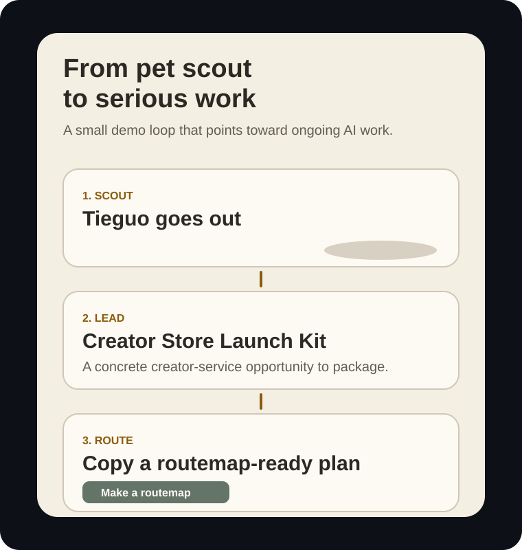

# Opportunity Pet

> Your pet is tired of sitting at home doing nothing. Now it scouts tiny money-making leads, brings them back to your desktop, and helps earn its own food.


Opportunity Pet is a free, open-source experiment for builders who collect too many ideas and execute too few of them.

You give it 3-5 photos of your own pet. It creates a small animated scout. Your pet wanders around your desktop, sniffs out a sellable micro-service, and asks: should we ignore this, package it, or grill it into real project work?




It is deliberately a little silly. That is the point. The pet is the hook; the real loop is:

```text
notice a lead -> stress-test it -> turn it into tasks -> keep the work moving
```

That loop is the part we care about. If the idea of ongoing AI work feels interesting, look at the system this experiment is pointing toward: [MAH Product System](https://dev.mah.bot/product).


## The Lead It Brings Back

The first lead is intentionally concrete:

> **Creator Store Launch Kit**
> Creators already sell templates, guides, prompt packs, and setup kits from Gumroad, Etsy, Stan Store, and link-in-bio pages. Many have a useful asset but no product page, delivery PDF, FAQ, launch copy, or result dashboard.

That is small enough to inspect in public, but real enough to become a product experiment. A builder could look at Gumroad, Etsy, Notion Marketplace, TikTok link-in-bio offers, and Reddit creator threads, then package one tiny service:

```text
messy creator asset -> product page -> delivery PDF -> launch copy -> result page
```

The pet does not magically make the business work. It makes the decision point visible: is this worth grilling, packaging, and turning into a routemap?

## The Money Page

The README story ends with a concrete platform-shaped result page: a Gumroad-style sales analytics screenshot for the product Codex helped package.


The result is deliberately modest:

```text
Product: Freelance Client Portal Kit
Orders: 7
Gross revenue: $203
Auto-delivered: 7/7
Refunds: 0
Net after fees: $181
```

Why this opportunity fits GitHub builders: Codex can create the product page, delivery PDF, FAQ, launch post, and result dashboard. The human still picks the niche and validates demand.

## What Gumroad Is

Gumroad is a lightweight commerce platform for creators who want to sell directly to an audience without building a full storefront. A creator can publish a product page, set a price, accept payment, deliver files or links, send receipts, manage customers, issue refunds, and inspect sales analytics from one dashboard.

It is especially relevant for this project because Gumroad is built around the kinds of things Codex can help package:

- Digital products: PDFs, guides, prompt packs, templates, ebooks, workbooks.
- Creator services: paid setup kits, consulting downloads, office hours, productized services.
- Courses and memberships: paid posts, email workflows, updates, and recurring offers.
- Analytics: views, sales, conversion rate, referrers, UTM links, locations, and customer exports.
- Customer operations: receipts, workflow emails, license keys, refunds, subscriptions, and CSV exports.

In this repo, Gumroad is not the whole business. It is the easiest platform-shaped proof surface: if a builder packages one useful creator asset, Gumroad gives them a familiar place to show whether people bought it, where buyers came from, whether files were delivered, and whether refunds happened.

## The Automation Plan

The service is narrow on purpose: **turn one messy creator asset into a Gumroad-ready digital product kit.** A real user could run it manually at first, then automate each step with Codex.

1. **Intake**
   The customer uploads a Notion page, Canva export, prompt pack, checklist, or rough Google Doc. The intake form asks for target buyer, promised outcome, price range, and refund policy.

2. **Packaging**
   Codex reads the asset and produces a product-positioning brief: title options, target buyer, before/after promise, table of contents, bonus files, FAQ, and risks that must not be overclaimed.

3. **Storefront Draft**
   Codex generates a Gumroad-style product page: headline, short description, cover image prompt, feature bullets, license notes, refund copy, and launch CTA. The human reviews claims before publishing.

4. **Delivery Kit**
   Codex creates the actual deliverables: cleaned PDF, Notion duplicate instructions, README, onboarding email, support FAQ, and a lightweight changelog. This is why the service can be AI-automated: the fulfillment artifact is mostly text, structure, and files.

5. **Order Handling**
   When an order comes in, automation sends the correct delivery link, records the buyer, tags source/referrer, and watches for refund or support events. A human only handles edge cases.

6. **Result Page**
   The app generates a proof page shaped like a Gumroad analytics/sales dashboard: revenue, orders, referrers, delivered count, refunds, and recent customers. The workflow shows what a real pilot should prove.

Feasibility boundary: this does **not** promise passive income or guaranteed sales. It is feasible because the first paid service is not "build a startup"; it is "package one creator asset well enough to sell and deliver." Codex can automate most of the packaging, delivery docs, launch copy, and reporting, while the human still validates demand and approves public claims.

## From Card To Work

When the lead looks interesting, Opportunity Pet copies a structured Grill-with-docs brief. The brief is not a business plan. It is the next useful object: a compact prompt that asks an agent to challenge the idea, resolve assumptions, and produce routemap-ready work.


That boundary matters. The pet is allowed to be playful. The work after the card should become serious, reviewable, and durable.

## Why This Exists

Most AI project ideas die in one of three places:

- They stay as bookmarks.
- They become a giant prompt nobody wants to run twice.
- They start in a chat window and lose context before anything real ships.

Opportunity Pet makes that failure mode visible and playful. A pet brings you a lead. You make one small decision. The next step is not "vibe harder"; it is a structured brief that can become a routemap, tasks, scheduled follow-ups, and reviewable work.

This repo is the toy version of a larger question:

> What if AI work did not live inside one disappearing chat, but inside an ongoing project system with context, agents, recovery, and human decisions?

That is the MAH-shaped question.

## What It Does Today


- Imports 3-5 pet photos and a pet name.
- Uses the user's signed-in Codex CLI to infer the pet identity, generate a multi-view character sheet, then generate the animated action pack.
- Creates six action states: idle, side-walk scout, curled sleep, happy response, butterfly chase, and yawn.
- Falls back to a transparent semi-realistic scout when Codex image generation is unavailable.
- Runs as a small transparent Electron desktop pet.
- Lets the pet scout curated opportunity cards.
- Copies a Grill-with-docs brief for leads the user wants to stress-test.
- Includes packaged desktop downloads for macOS, Windows, and Linux.

Tieguo is only the default development sample. Your pet is supposed to replace him.

## The Loop

1. Import a few photos of your pet.
2. Generate a tiny animated scout.
3. Let it bring back an opportunity card.
4. Approve the lead or send the pet back out.
5. Copy the Grill-with-docs brief.
6. Open the money page to see what a finished pilot result could look like.
7. Turn the fuzzy lead into a routemap-ready plan.
8. Continue the work in a real ongoing-work system such as [MAH](https://dev.mah.bot/product).

The current opportunities are curated examples, not live search results. The main showcase is intentionally tuned for GitHub builders: creator-store packaging, digital product launch kits, small automation services, and other experiments where Codex can generate the fulfillment artifact.

## Public Signals

This is not a revenue promise, but the ecosystem is real:

- [Stan Store](https://www.stan.store/) positions itself as a creator store for digital products, courses, and bookings.
- Guides to selling Notion templates commonly point to [Gumroad, Etsy, Notion Marketplace, and creator-owned sites](https://howtostart.biz/how-to-make-money-selling-notion-templates/) as distribution channels.
- Creator monetization guides suggest low-ticket digital products, mini courses, coaching, and link-in-bio CTAs as common offers ([Stan Store guide](https://stan.store/blog/how-to-grow-on-tiktok/)).

## Download

Open the repository's **Releases** page and download the build for your system:

- macOS: Apple Silicon or Intel `.dmg` / `.zip`
- Windows: Setup or Portable `.exe`
- Linux: `.AppImage`

These early community builds are not code-signed. macOS may require right-clicking the app and choosing **Open** the first time. Windows SmartScreen may require **More info > Run anyway**. Only download builds from this repository.

## Run From Source

```bash
npm install
npm run prepare:assets
npm run check
npm run start
```

For personalized AI actions, install and sign in to Codex before starting Opportunity Pet. The app detects the CLI automatically and keeps `Generate with Codex` as the main path. If AI image generation is unavailable, the app can still create a local transparent cartoon scout from the uploaded photo palette so the desktop flow works immediately.

Opportunity Pet pins Codex generation to `gpt-5.6-luna` by default so it does not inherit an unsupported model from your global Codex config. Luna is the faster, more affordable 5.5+ option in current Codex model listings. To override it:

```bash
OPPORTUNITY_PET_CODEX_MODEL=gpt-5.5 npm run start
```

Direct generation also requires the Codex CLI session to have access to built-in image generation. If Codex can chat but image generation returns `HTTP 403 Forbidden`, the app reports that exact failure and automatically falls back to a local cartoon action pack.

If Electron's postinstall download fails:

```bash
npm run install:electron
npm run start
```

## Build The Desktop App

```bash
npm ci
npm run check
npm run dist
```

Build output is written to `release/`. The included GitHub Actions workflow builds macOS, Windows, and Linux artifacts. Creating a tag such as `v0.1.0` publishes those artifacts to a GitHub Release.

## Privacy And Boundaries

Opportunity Pet does not run a paid backend and does not require an Opportunity Pet API key.

The AI generation path uses your signed-in Codex CLI and may count against that account's usage limits. Selected photos are copied into the app's local user-data directory for the generation job, then temporary input copies are deleted. Generated action assets remain local.

Opportunity Pet does not promise revenue, choose what you should build, or automate business decisions. It only turns "maybe this is interesting" into a small decision point and a planning brief.

## How This Points To MAH

Opportunity Pet is not trying to explain MAH in full. It is trying to make one feeling obvious:

> A good AI workflow should keep moving after the first prompt.

MAH is built around that ongoing-work layer: project context, planned multi-agent execution, background continuity, recovery, and decision-ready review. If this pet makes you want a bigger system behind the loop, start here:

[Explore MAH Product System ->](https://dev.mah.bot/product)

## Roadmap

- Replace static opportunities with pluggable opportunity sources.
- Add a cleaner handoff into Grill-with-docs and MAH routemap flows.
- Improve generated pet quality checks with visual regression tests.
- Add a short product video or GIF once the flow is stable enough to show in one glance.
- Keep the project weird enough that people actually remember it.
